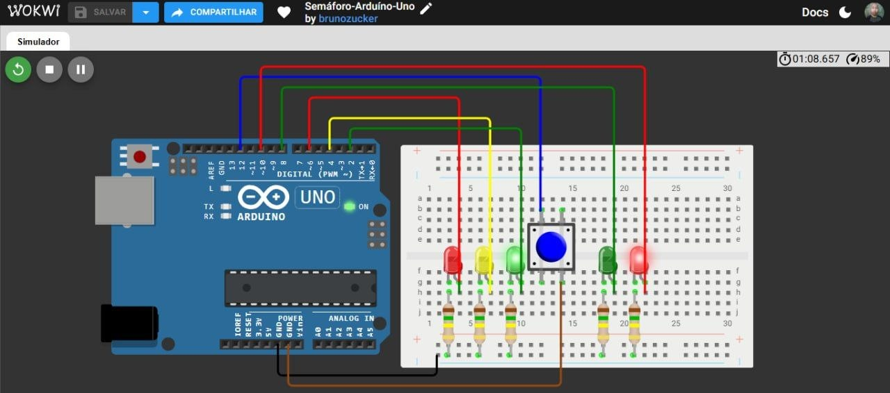

# 🚦 Semáforo-Arduino-Uno

Simulação de um cruzamento com semáforo de carros, semáforo de pedestres e botão de travessia, feita com Arduino Uno no Wokwi.

---

## 📋 Sobre o projeto

A ideia foi reproduzir o funcionamento de uma faixa de pedestres com botão: os carros seguem com o sinal verde até alguém pedir para atravessar, e aí o semáforo faz toda a transição até liberar o pedestre.

O projeto foi feito como parte do meu portfólio prático de sistemas embarcados, usando o Wokwi como ambiente de simulação.

▶️ [Abrir a simulação no Wokwi](https://wokwi.com/projects/475978723933270017)

---

## 🛠 Ferramentas utilizadas

- Wokwi (simulador)
- Arduino Uno
- Protoboard
- 3 LEDs para o semáforo dos carros (verde, amarelo e vermelho)
- 2 LEDs para o semáforo dos pedestres (verde e vermelho)
- 1 botão (pushbutton)
- 5 resistores de 150 kΩ, um por LED (pode ser trocado por 220 Ω ou 330 Ω, veja a nota no final)
- Linguagem C++ (Arduino)

---

## 🏗 O que foi montado

O circuito tem dois semáforos e um botão. O semáforo dos carros usa três LEDs e o dos pedestres usa dois. Cada LED tem um resistor em série ligado ao trilho de GND da protoboard.

O botão fica ligado entre o pino 12 e o GND. Como o código usa o resistor de pull-up interno do Arduino, não foi preciso colocar nenhum resistor externo nele.

### Pinagem

| Componente | Pino do Arduino |
|---|---|
| LED verde (carros) | 2 |
| LED amarelo (carros) | 4 |
| LED vermelho (carros) | 6 |
| LED verde (pedestres) | 8 |
| LED vermelho (pedestres) | 10 |
| Botão de travessia | 12 |

---

## 🔧 Como funciona

### Estado inicial

Sem ninguém apertar o botão, o semáforo dos carros fica **verde** e o dos pedestres fica **vermelho**.

### Quando o botão é pressionado

1. O código faz um debounce simples: espera 50 ms e confirma se o botão continua pressionado, pra evitar leitura falsa por ruído.
2. O verde dos carros continua aceso por 5 segundos e depois apaga.
3. O vermelho dos carros pisca 3 vezes.
4. O amarelo dos carros pisca 4 vezes.
5. O vermelho dos carros fica aceso e o pedestre recebe o verde.
6. O pedestre tem 5 segundos para atravessar.
7. Os LEDs apagam e o ciclo volta ao estado inicial.

No total, uma travessia completa leva cerca de 17 segundos.

---

## 💻 Código

```cpp
// Semáforo-Arduíno-Uno

// Define os pinos dos LEDs do semáforo dos carros
#define LED_S_VERDE 2
#define LED_S_AMARELO 4
#define LED_S_VERMELHO 6

// Define os pinos dos LEDs do semáforo dos pedestres
#define LED_P_VERDE 8
#define LED_P_VERMELHO 10

// Define o pino do botão para solicitar a travessia
#define BOTAO 12

void setup() {
  // LEDs do semáforo como "saída"
  pinMode(LED_S_VERDE, OUTPUT);
  pinMode(LED_S_AMARELO, OUTPUT);
  pinMode(LED_S_VERMELHO, OUTPUT);

  // LEDs do pedestre como "saída"
  pinMode(LED_P_VERDE, OUTPUT);
  pinMode(LED_P_VERMELHO, OUTPUT);

  // Configura o botão como entrada utilizando o resistor de pull-up interno
  pinMode(BOTAO, INPUT_PULLUP);
}

void loop() {
  // Estado inicial, ambos ligados
  digitalWrite(LED_S_VERDE, HIGH);
  digitalWrite(LED_P_VERMELHO, HIGH);

  // Espera o botão ser pressionado
  if (digitalRead(BOTAO) == LOW) 
  {
    // Debounce simples
    delay(50);
    
    // Confirma se o botão continua pressionado
    if (digitalRead(BOTAO) == LOW)
    {
      // Mantém o verde do semáforo durante 5 segundos
      delay(5000);

      // Apaga o verde do semáforo
      digitalWrite(LED_S_VERDE, LOW);

      // Vermelho do semáforo piscando três "i < 3;" vezes 
      for (int i = 0; i < 3; i++)
      {
        // Ligado
        digitalWrite(LED_S_VERMELHO, HIGH);
        delay(500);
        // Desligado
        digitalWrite(LED_S_VERMELHO, LOW);
        delay(500);
      }

      for (int i = 0; i < 4; i++)
      {
        // Ligado
        digitalWrite(LED_S_AMARELO, HIGH);
        delay(500);
        // Desligado
        digitalWrite(LED_S_AMARELO, LOW);
        delay(500);
      }
      // Semáfro vermelho ligado
      digitalWrite(LED_S_VERMELHO, HIGH);

      // Pedestre verde ligado
      digitalWrite(LED_P_VERDE, HIGH);

      // Pedestre vermelho desligado
      digitalWrite(LED_P_VERMELHO, LOW);

      // Tempo para o pedestre atravessar
      delay(5000);

      // LED verde do pedestre desligado
      digitalWrite(LED_P_VERDE, LOW);

      // LED vermelho do semáforo desligado
      digitalWrite(LED_S_VERMELHO, LOW);
    }
  }
}
```

---

## 📸 Evidências do funcionamento

### Circuito montado no Wokwi
A visão geral mostra o Arduino Uno, a protoboard com os cinco LEDs, os resistores e o botão azul de travessia.



---

## 📁 Arquivo do diagrama

O arquivo `diagram.json` com todas as peças e conexões está disponível no repositório e pode ser importado direto no Wokwi.

[📥 Download — diagram.json](diagram.json)

---

## 💡 O que aprendi com esse projeto

O principal foi usar o `INPUT_PULLUP`. Com ele o botão só precisa ser ligado entre o pino e o GND, e o Arduino entende `LOW` como botão pressionado. Isso deixa o circuito mais simples, sem resistor externo.

Outro ponto foi o debounce. Um botão físico gera ruído quando é pressionado, então confirmar a leitura depois de 50 ms evita que o ciclo dispare por engano.

Também ficou claro o limite do `delay()`: enquanto a sequência roda, o Arduino não faz mais nada, então o botão não é lido. Pra esse projeto funciona bem, mas uma evolução seria usar `millis()` para não bloquear o programa.

---

## ⚠️ Sobre o projeto

Essa simulação é uma versão simples de um semáforo de pedestres. Ela não tem sensor de carros, temporização variável nem ciclo automático. O objetivo foi praticar o controle de saídas digitais, leitura de botão e sequência de estados.

Nos meus projetos de semáforo eu costumo começar com resistores de 150 kΩ, e na simulação os LEDs acendem normalmente. Se você quiser montar o circuito de verdade, ou só deixar o brilho mais forte no Wokwi, dá para trocar por resistores de 220 Ω ou 330 Ω sem mexer no código. Com 5 V, esses valores deixam passar uma corrente de uns 10 a 14 mA, que é o brilho normal de um LED comum.

---

## 🚀 Próximos projetos

Outros projetos de sistemas embarcados serão postados em breve, com níveis de complexidade maiores.

---

## 👤 Autor: Bruno Zucker
